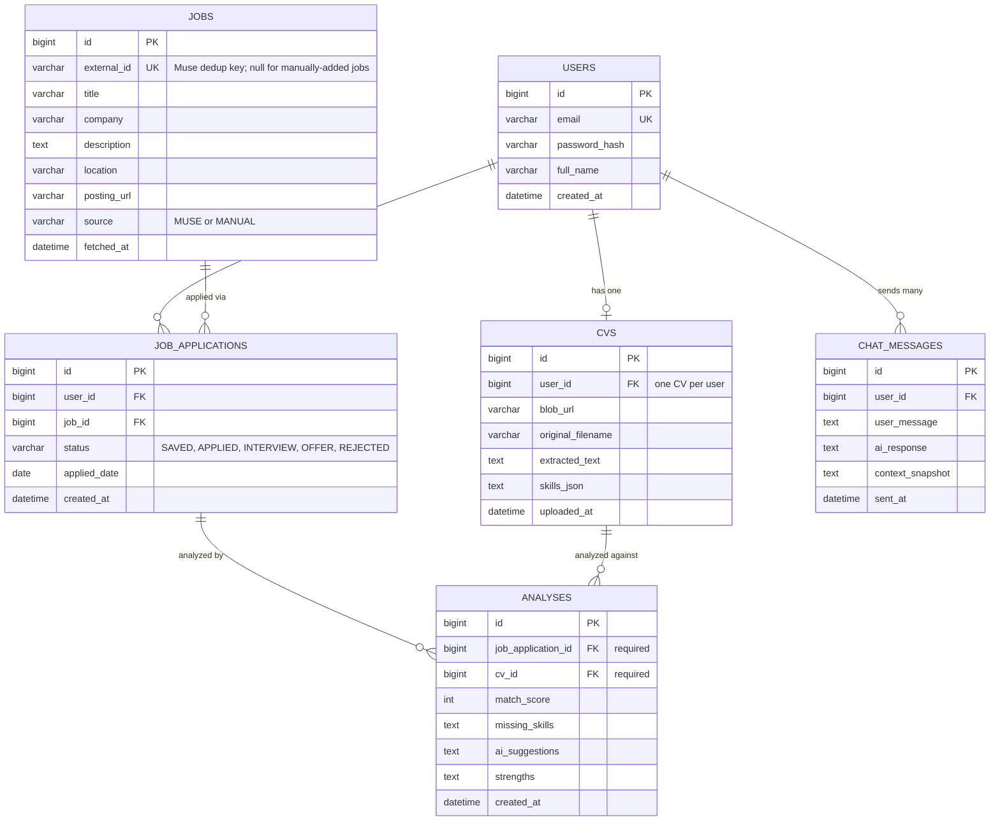
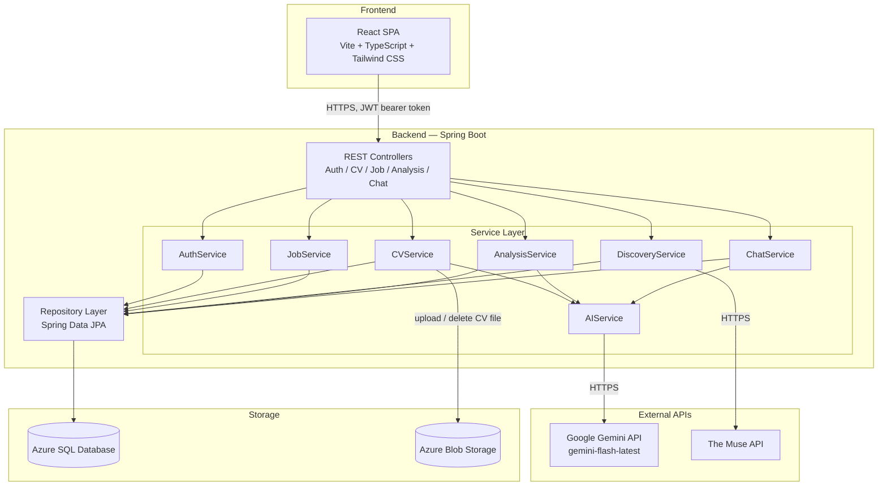
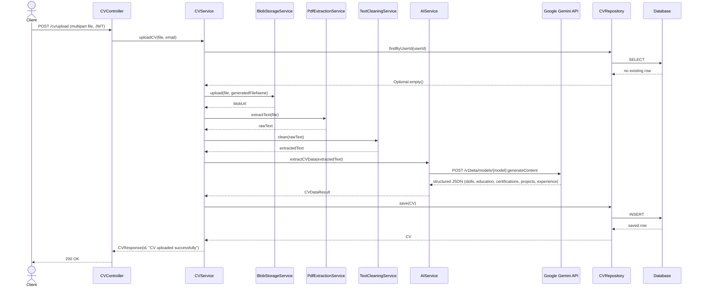

# Architecture

This document covers the data model, system architecture, and a representative request flow for the Job Assistant AI backend. Diagrams are Mermaid, rendered natively by GitHub — no image export or external tooling needed.

All three diagrams were built by reading the actual entity, service, and controller classes rather than the original design notes, so a couple of details below differ slightly from earlier planning docs. Those are called out where relevant.

---

## 1. Entity-Relationship Diagram

**Notes on how this maps to the actual JPA entities:**

- The `@Table` names in code are singular for two entities — `cv` and `analysis` — not `cvs`/`analyses`. The diagram uses plural labels for readability; the underlying tables are singular.
- `CVS.user_id` is not a database-level unique constraint (no `unique = true` on the column) — the one-CV-per-user rule is enforced in `CVServiceImpl.uploadCV()`, which throws `DuplicateResourceException` if a CV already exists for that user. It's a true 1:1 in practice, just enforced in the service layer rather than the schema.
- `ANALYSES` only has a foreign key to `job_applications` and `cv` — **not** a direct foreign key to `jobs`. Both `@ManyToOne` relationships on `Analysis` are `optional = false`, so every analysis requires an existing tracked application; there's no "analyze before saving" path in the current implementation, even though that was discussed early on.
- `JOBS.posting_url` stores the original listing URL (captured from Muse's `refs.landing_page`, or entered manually) so users can click through to the real posting.
- Every entity uses the Builder pattern with a protected no-arg constructor (for JPA) and a private all-args constructor via `Builder.build()` — not shown in the ERD since that's a Java-level pattern, not a schema detail.

---

## 2. System Architecture

`JobService` covers manual job CRUD and application status updates; `DiscoveryService` covers auto-discovery via Muse (it delegates the actual HTTP calls to a `MuseApiClient`, omitted here as an implementation detail of the same service). `CVService` similarly delegates the Blob Storage calls to a `BlobStorageService` — shown here as a direct edge for clarity, since architecturally it's still "the CV layer talks to Blob Storage."

---

## 3. Request Flow: CV Upload

The CV upload path is the most involved single request in the system — it touches file storage, text extraction, an external AI call, and persistence in one transaction. Sequence shown here is for the PDF path (`POST /cv/upload`); a DOCX upload is identical except `WordExtractionService` stands in for `PdfExtractionService`.

If a CV already exists for that user, the flow short-circuits right after the `findByUserId` check with a `409 Conflict` (`DuplicateResourceException`) — re-uploading requires `PUT /cv/upload` instead, which follows the same pipeline but deletes the old blob before writing the new one.

---

## Related

- [README.md](../README.md) — setup, running locally, API endpoint list
- `AI_Job_Assistant_Project_Context.md` — product vision, decision history, and challenges hit during development (broader and more narrative than this doc; this file is the up-to-date structural reference)
